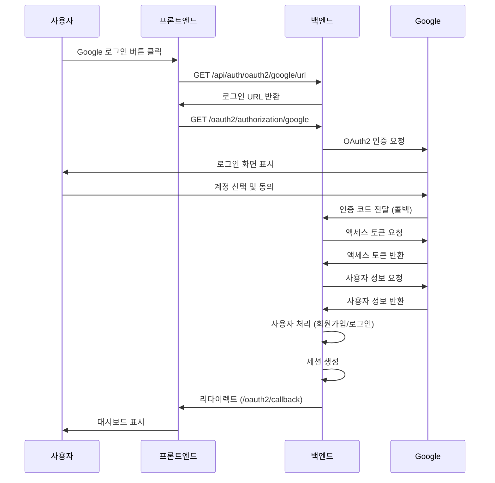

# Google OAuth2 로그인 구현 완료 및 설정 가이드

## 📋 구현 완료 항목

### ✅ 1단계: 의존성 및 설정
- [x] `build.gradle`에 OAuth2 Client 의존성 추가
- [x] `application.yml`에 Google OAuth2 설정 추가

### ✅ 2단계: 데이터 모델 확장
- [x] `UserDTO`에 OAuth2 필드 추가 (provider, providerId, profileImage)
- [x] `UserMapper`에 OAuth2 메서드 추가 (findByProviderAndProviderId, insertOAuth2User)
- [x] `UserMapper.xml`에 OAuth2 쿼리 추가

### ✅ 3단계: DTO 및 서비스 구현
- [x] `OAuth2UserInfo` DTO 클래스 생성
- [x] `OAuth2AuthService` 비즈니스 로직 구현

### ✅ 4단계: 컨트롤러 구현
- [x] `OAuth2AuthController` API 엔드포인트 구현

### ✅ 5단계: Spring Security 연동
- [x] `CustomOAuth2UserService` 구현
- [x] `OAuth2AuthenticationSuccessHandler` 구현
- [x] `OAuth2AuthenticationFailureHandler` 구현

### ✅ 6단계: Security 설정
- [x] `SecurityConfig`에 OAuth2 로그인 설정 추가

---

## 🔧 설정 방법

### 1. Gradle 의존성 새로고침

프로젝트 루트에서 다음 명령어를 실행하거나 IDE에서 Gradle을 새로고침하세요:

```bash
./gradlew clean build
```

또는 IntelliJ IDEA/Eclipse에서:
- `Gradle` 탭 → `Reload All Gradle Projects` 클릭

### 2. Google Cloud Console 설정

#### 2.1 Google Cloud 프로젝트 생성
1. [Google Cloud Console](https://console.cloud.google.com/) 접속
2. 새 프로젝트 생성 또는 기존 프로젝트 선택

#### 2.2 OAuth 2.0 클라이언트 ID 생성
1. **API 및 서비스** → **사용자 인증 정보** 메뉴 이동
2. **사용자 인증 정보 만들기** → **OAuth 클라이언트 ID** 선택
3. 애플리케이션 유형: **웹 애플리케이션**
4. 이름: `Medi Backend OAuth2`
5. **승인된 리디렉션 URI** 추가:
   - 개발 환경: `http://localhost:8080/login/oauth2/code/google`
   - 프로덕션 환경: `https://yourdomain.com/login/oauth2/code/google`
6. **만들기** 클릭
7. 생성된 **클라이언트 ID**와 **클라이언트 보안 비밀** 복사

#### 2.3 OAuth 동의 화면 구성
1. **OAuth 동의 화면** 메뉴 이동
2. 사용자 유형: **외부** 선택 (테스트용) 또는 **내부** (조직용)
3. 앱 정보 입력:
   - 앱 이름: `Medi`
   - 사용자 지원 이메일
   - 개발자 연락처 정보
4. 범위 추가:
   - `userinfo.email`
   - `userinfo.profile`
5. 저장 및 계속

### 3. 환경 변수 설정

#### 3.1 Windows (PowerShell)
```powershell
$env:GOOGLE_CLIENT_ID="your-google-client-id"
$env:GOOGLE_CLIENT_SECRET="your-google-client-secret"
```

#### 3.2 macOS/Linux (Bash)
```bash
export GOOGLE_CLIENT_ID="your-google-client-id"
export GOOGLE_CLIENT_SECRET="your-google-client-secret"
```

#### 3.3 IntelliJ IDEA 설정
1. **Run** → **Edit Configurations**
2. **Environment variables** 필드에 추가:
```
GOOGLE_CLIENT_ID=your-google-client-id;GOOGLE_CLIENT_SECRET=your-google-client-secret
```

#### 3.4 application.yml (직접 설정 - 개발용만)
⚠️ **주의**: 프로덕션 환경에서는 절대 사용하지 마세요!

```yaml
spring:
  security:
    oauth2:
      client:
        registration:
          google:
            client-id: your-google-client-id
            client-secret: your-google-client-secret
```

### 4. 데이터베이스 테이블 확인

`users` 테이블이 OAuth2 필드를 포함하고 있는지 확인하세요:

```sql
-- 테이블 구조 확인
DESC users;

-- 필요한 컬럼들:
-- provider VARCHAR(20) DEFAULT 'LOCAL'
-- provider_id VARCHAR(255) NULL
-- profile_image VARCHAR(2048) NULL
```

컬럼이 없으면 다음 쿼리로 추가:

```sql
ALTER TABLE users
ADD COLUMN provider VARCHAR(20) DEFAULT 'LOCAL' AFTER role,
ADD COLUMN provider_id VARCHAR(255) NULL AFTER provider,
ADD COLUMN profile_image VARCHAR(2048) NULL AFTER provider_id;
```

---

## 🚀 실행 및 테스트

### 1. 애플리케이션 실행

```bash
./gradlew bootRun
```

또는 IDE에서 `BackendApplication` 실행

### 2. API 엔드포인트 확인

#### 2.1 Google 로그인 URL 조회
```bash
curl http://localhost:8080/api/auth/oauth2/google/url
```

응답:
```json
{
  "url": "/oauth2/authorization/google",
  "message": "Google 로그인 URL입니다. 이 URL로 리다이렉트하세요."
}
```

#### 2.2 OAuth2 로그인 플로우 테스트

1. 브라우저에서 접속:
```
http://localhost:8080/oauth2/authorization/google
```

2. Google 계정으로 로그인

3. 로그인 성공 시 자동으로 프론트엔드로 리다이렉트:
```
http://localhost:3000/oauth2/callback
```

4. 세션에 사용자 정보 저장됨

#### 2.3 사용자 정보 조회
```bash
curl -X GET http://localhost:8080/api/auth/oauth2/user \
  --cookie "MEDI_SESSION=your-session-id"
```

응답:
```json
{
  "success": true,
  "user": {
    "id": 1,
    "email": "user@gmail.com",
    "name": "홍길동",
    "provider": "GOOGLE",
    "providerId": "google-sub-id",
    "profileImage": "https://lh3.googleusercontent.com/...",
    "role": "USER"
  },
  "message": "사용자 정보 조회 성공"
}
```

#### 2.4 로그인 상태 확인
```bash
curl -X GET http://localhost:8080/api/auth/oauth2/status \
  --cookie "MEDI_SESSION=your-session-id"
```

응답:
```json
{
  "isLoggedIn": true,
  "provider": "GOOGLE",
  "email": "user@gmail.com",
  "name": "홍길동"
}
```

#### 2.5 로그아웃
```bash
curl -X POST http://localhost:8080/api/auth/oauth2/logout \
  --cookie "MEDI_SESSION=your-session-id"
```

응답:
```json
{
  "success": true,
  "message": "로그아웃 성공"
}
```

---

## 📁 생성된 파일 목록

### 1. DTO
- `src/main/java/com/medi/backend/auth/dto/OAuth2UserInfo.java`

### 2. Service
- `src/main/java/com/medi/backend/auth/service/OAuth2AuthService.java`

### 3. Controller
- `src/main/java/com/medi/backend/auth/controller/OAuth2AuthController.java`

### 4. Security
- `src/main/java/com/medi/backend/global/security/service/CustomOAuth2UserService.java`
- `src/main/java/com/medi/backend/global/security/handler/OAuth2AuthenticationSuccessHandler.java`
- `src/main/java/com/medi/backend/global/security/handler/OAuth2AuthenticationFailureHandler.java`

### 5. 수정된 파일
- `build.gradle` - OAuth2 의존성 추가
- `application.yml` - OAuth2 설정 추가
- `UserDTO.java` - OAuth2 필드 추가 (provider, providerId, profileImage)
- `UserMapper.java` - OAuth2 메서드 추가
- `UserMapper.xml` - OAuth2 쿼리 추가
- `SecurityConfig.java` - OAuth2 로그인 설정 추가

---

## 🔄 OAuth2 로그인 플로우



---

## 🔒 보안 고려사항

### 1. 환경 변수 관리
- **절대** Git에 커밋하지 마세요
- `.gitignore`에 환경 변수 파일 추가
- 프로덕션 환경에서는 Secret Manager 사용 권장

### 2. HTTPS 사용
- 프로덕션 환경에서는 **반드시** HTTPS 사용
- `application.yml`에서 `secure: true` 설정

### 3. CORS 설정
- `application.yml`의 `cors.allowed-origins`에 신뢰할 수 있는 도메인만 추가

### 4. 세션 관리
- 세션 타임아웃: 30분 (필요시 조정)
- 동시 세션 제한: 1개

---

## 🐛 문제 해결

### 1. "OAuth2 의존성을 찾을 수 없습니다"
**해결**: Gradle 새로고침
```bash
./gradlew clean build --refresh-dependencies
```

### 2. "redirect_uri_mismatch" 오류
**해결**: Google Cloud Console에서 리다이렉트 URI 확인
- 등록된 URI: `http://localhost:8080/login/oauth2/code/google`
- 대소문자, 슬래시 포함 정확히 일치해야 함

### 3. "invalid_client" 오류
**해결**: 환경 변수 확인
```bash
echo $GOOGLE_CLIENT_ID
echo $GOOGLE_CLIENT_SECRET
```

### 4. 세션에 사용자 정보가 없음
**해결**: 쿠키 설정 확인
- 프론트엔드에서 `credentials: 'include'` 설정
- CORS 설정에서 `allowCredentials: true` 확인

### 5. 데이터베이스 오류
**해결**: OAuth2 컬럼 존재 여부 확인
```sql
DESC users;
```

---

## 📚 참고 자료

- [Spring Security OAuth2 Client 공식 문서](https://docs.spring.io/spring-security/reference/servlet/oauth2/client/index.html)
- [Google OAuth2 가이드](https://developers.google.com/identity/protocols/oauth2)
- [Spring Boot OAuth2 튜토리얼](https://spring.io/guides/tutorials/spring-boot-oauth2)

---

## 📞 지원

문제가 발생하면 다음을 확인하세요:
1. 애플리케이션 로그 (`logging.level.com.medi.backend: DEBUG`)
2. Google Cloud Console OAuth2 설정
3. 환경 변수 설정
4. 데이터베이스 테이블 구조

---

**구현 완료일**: 2025-11-04  
**버전**: 1.0.0

